#AUFGABE 4: SPRING DATA JPA VERTIEFUNG 
Ziel:
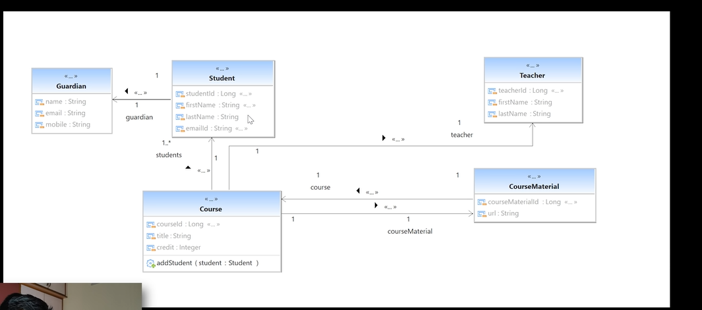

Initial:
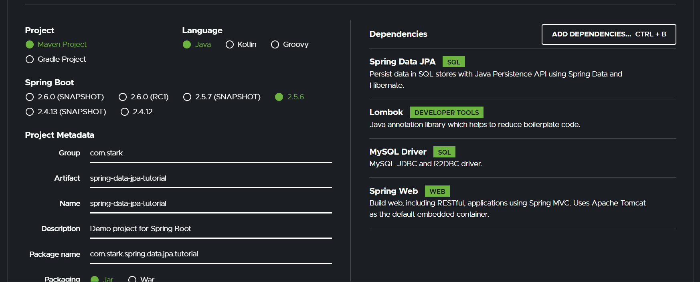

## Table of Contents
1.[Connecting with the DB](#connecting_with_db)
2.[Mapping Entities with the DB](#mapping_entities_with_db)

## Connecting with DB 
JPA with Hibernate integration

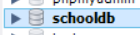
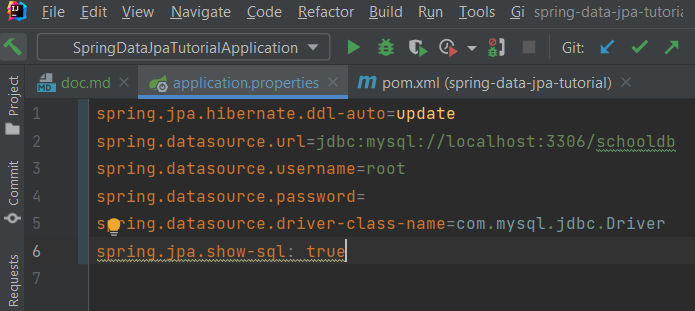

## Mapping Entities with DB 

Studen class:
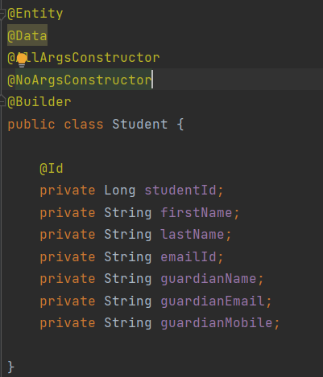

## Different JPA Annotations
Die Jakarta Persistence API (JPA; früher Java Persistence API) ist eine Schnittstelle für Java-Anwendungen, 
die die Zuordnung und die Übertragung von Objekten zu Datenbankeinträgen vereinfacht.

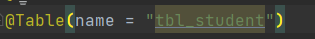
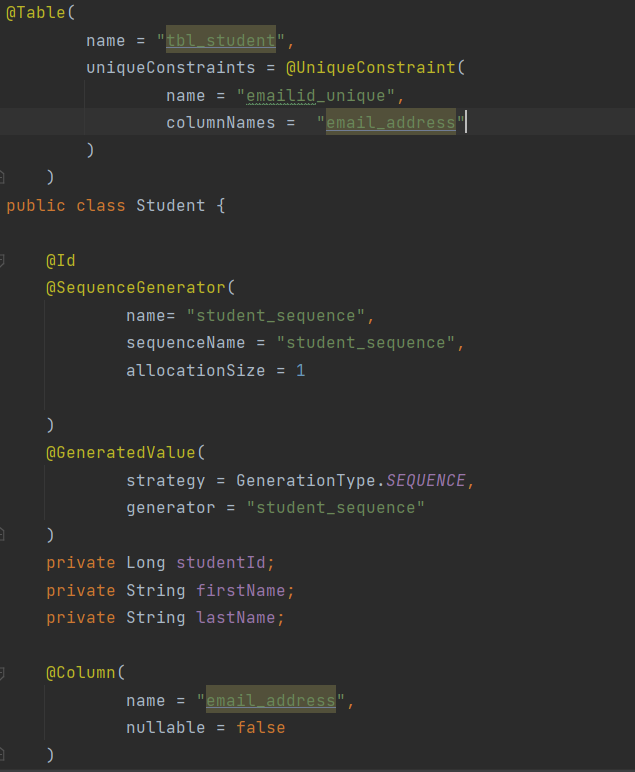
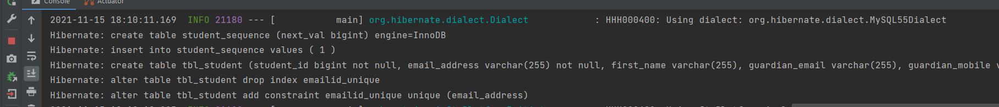

## Repository
Nützliche Funktionen
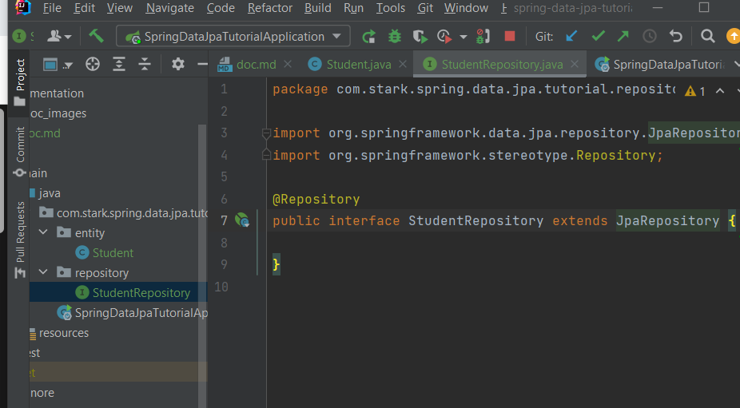

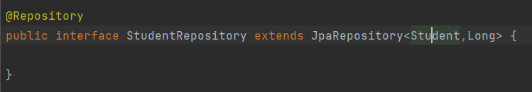

Testing:
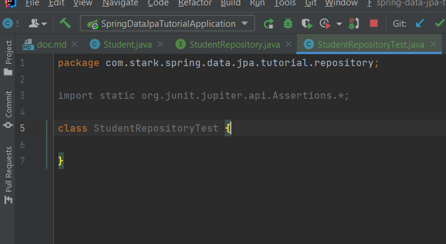
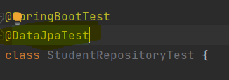
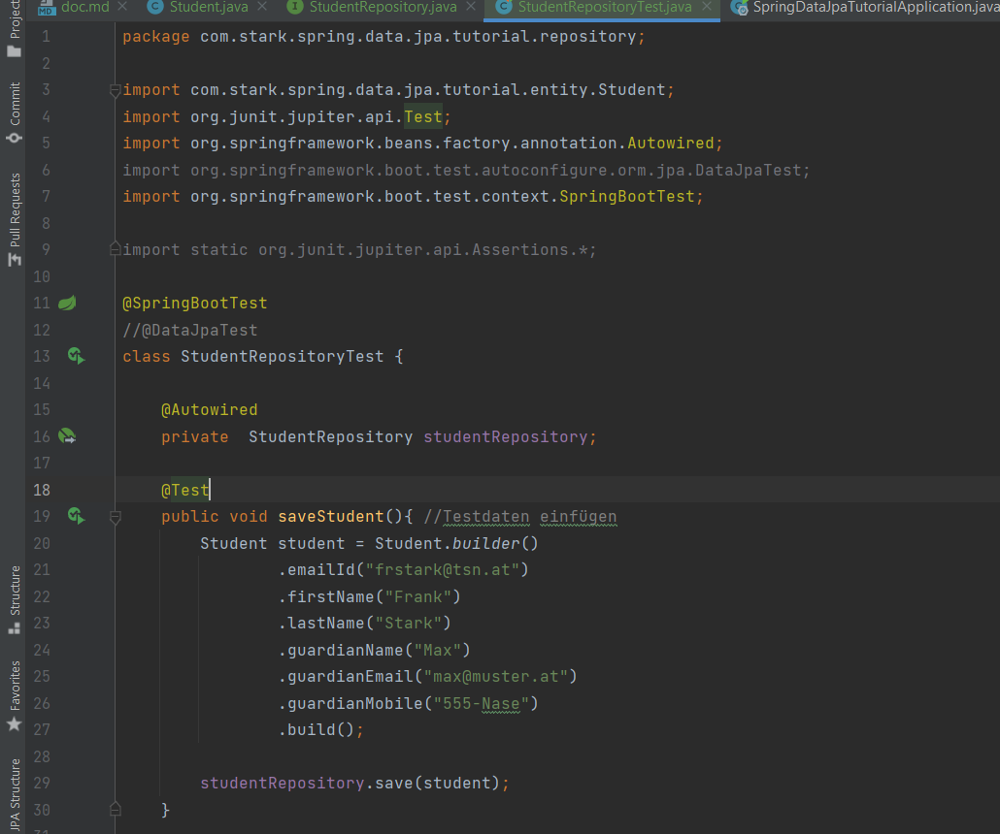

## Embedded

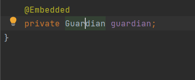

Bestehende Spalten überschreiben

Test:
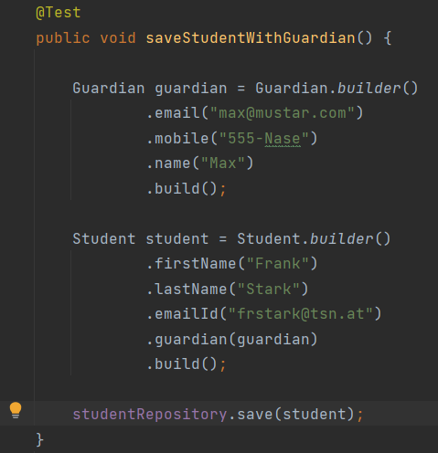
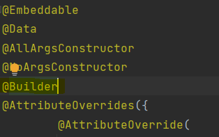

## Creating JPA Repository

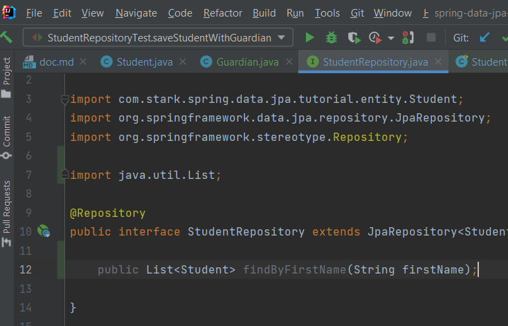

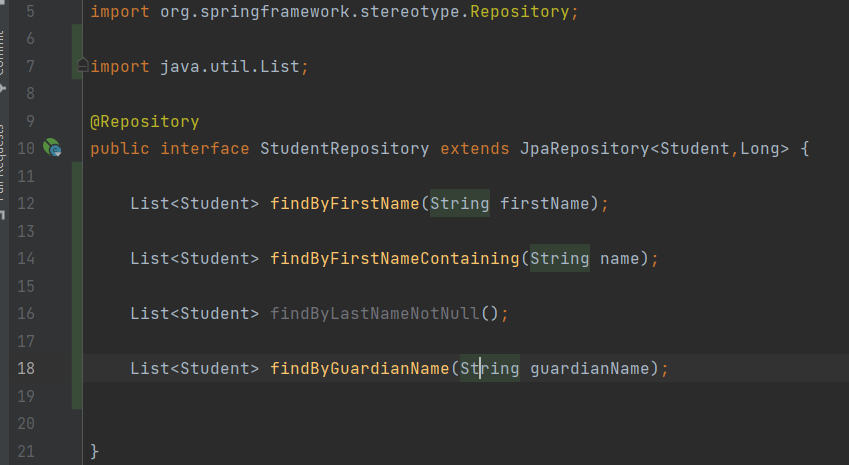

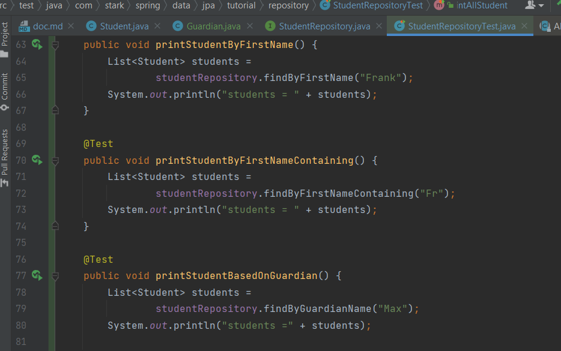

