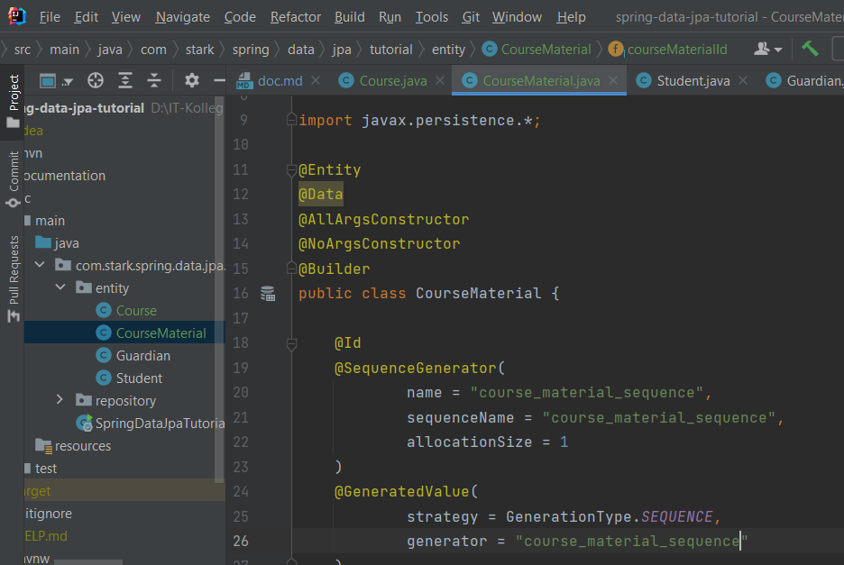

#AUFGABE 4: SPRING DATA JPA VERTIEFUNG 
Ziel:

Initial:

## Table of Contents
1.[Connecting with the DB](#connecting_with_db)
2.[Mapping Entities with the DB](#mapping_entities_with_db)
3.[JPA Relationships](#jpa_relationships)
3.1[One-To-Many Relationships](#one_to_one)
3.2[One-To-Many Relationships](#one_to_many)

## Connecting with DB 
JPA with Hibernate integration

## Mapping Entities with DB 

Studen class:

## Different JPA Annotations
Die Jakarta Persistence API (JPA; früher Java Persistence API) ist eine Schnittstelle für Java-Anwendungen, 
die die Zuordnung und die Übertragung von Objekten zu Datenbankeinträgen vereinfacht.

## Repository
Nützliche Funktionen

Testing:

## Embedded

Bestehende Spalten überschreiben

Test:

## Creating JPA Repository

## JPQL Query

## Native Query

## Transactional and @Modifying Annotations

Rollback bei Fehler

## JPA  Relationships 

### One to One relationship 

Course to CourseMaterial 

Entities

Beziehung einbauen

Repository erstellen

Testing

Fehler da versucht wurde Course zu speichern ohne einen course erstellt zu haben.

Cascading
Gibt die properties von den Eltern zum Kind

 Fetch Type

Ergebnis:

Uni & Bi directional relationship

### One to Many Relationship 

Lehrer kann mehrere Kurse haben

#### Many to One:
Besser als One to Many

Test:

