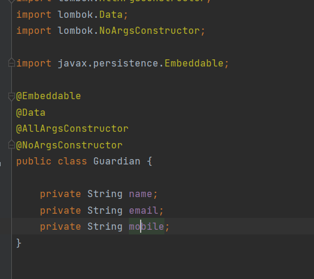
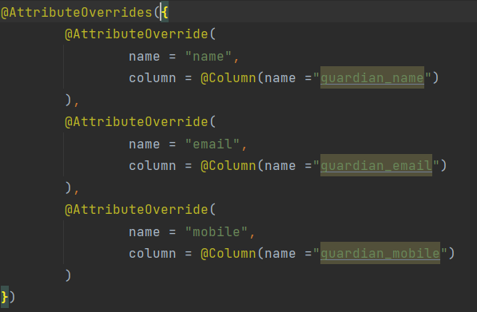

#AUFGABE 4: SPRING DATA JPA VERTIEFUNG 
Ziel:

Initial:

## Table of Contents
1.[Connecting with the DB](#connecting_with_db)
2.[Mapping Entities with the DB](#mapping_entities_with_db)

## Connecting with DB 
JPA with Hibernate integration

## Mapping Entities with DB 

Studen class:

## Different JPA Annotations
Die Jakarta Persistence API (JPA; früher Java Persistence API) ist eine Schnittstelle für Java-Anwendungen, 
die die Zuordnung und die Übertragung von Objekten zu Datenbankeinträgen vereinfacht.

## Repository
Nützliche Funktionen

Testing:

## Embedded

Bestehende Spalten überschreiben

Test:

## Creating JPA Repository

